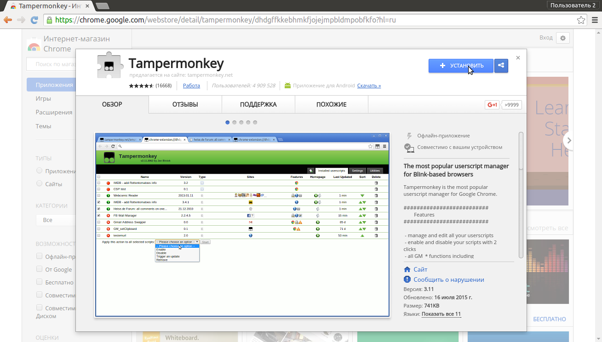
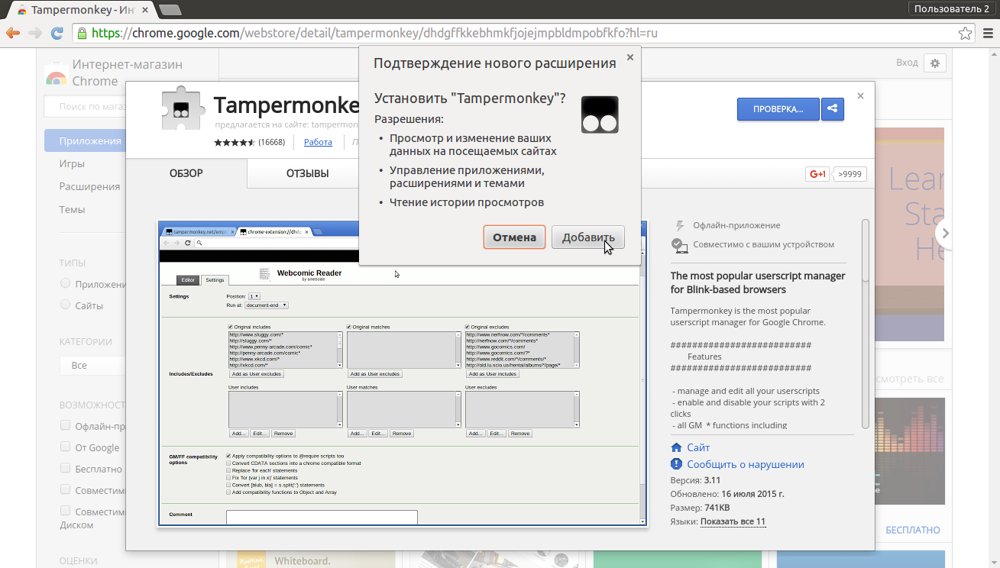
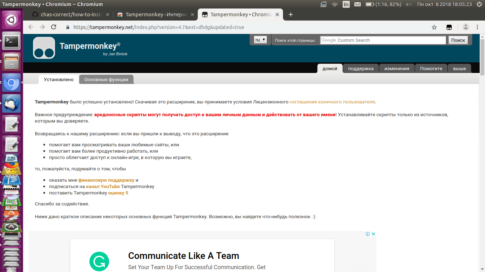
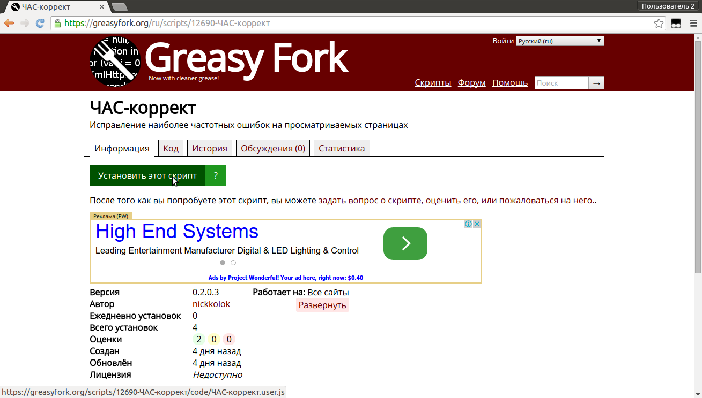
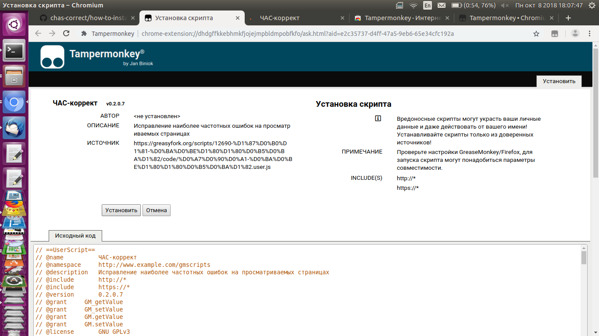
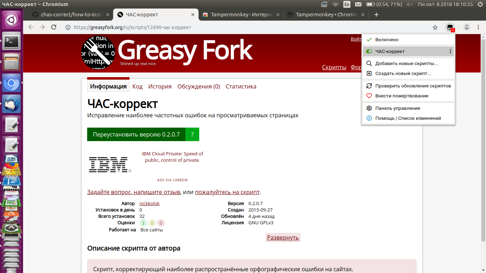

#Инструкция по установке "ЧАС-коррект" на Chromium и ему подобные браузеры
*(Google Chrome, Яндекс.Браузер, Opera, Спутник и прочие элементы таблицы Менделеева)*

1. Открываем [страницу расширения Tampermonkey](https://chrome.google.com/webstore/detail/tampermonkey/dhdgffkkebhmkfjojejmpbldmpobfkfo?hl=ru) в каталоге расширений.
Это - программа-переходник между браузером и собственно "ЧАС-коррект". По некоторым причинам установка напрямую сейчас невозможна.
2. Нажимаем "Установить". 

3. Соглашаемся с предупреждением о том, что расширение будет иметь доступ к личным данным. Тут деваться некуда - мы же хотим, чтобы сообщения ВКонтакте исправлялись?

4. После успешной установки TamperMonkey закрываем вот такое окошко, которое говорит нам, что всё хорошо:

5. Теперь переходим на [страницу собственно "ЧАС-коррект"](https://greasyfork.org/ru/scripts/12690-ЧАС-коррект/).
6. Нажимаем "Установить этот скрипт".

7. Ещё раз выбираем "Установить"

8. Теперь обновляем эту страницу. Если Вы не видете сдесь ошыбок - значит, оно работает!

Кстати, при желании можно отключить коррекцию на некоторое время. В меню Tampermonkey есть специальная кнопка:

Зелёное - включено, серое - выключено, переключать щелчком.
