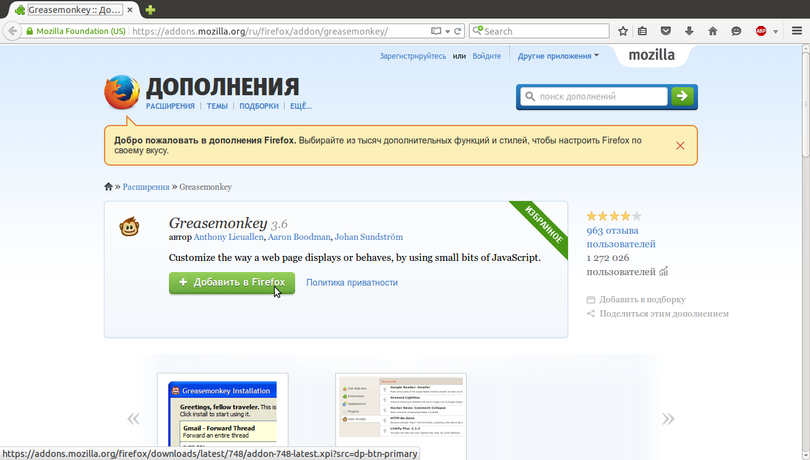
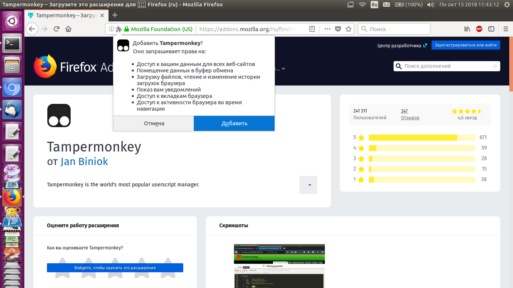
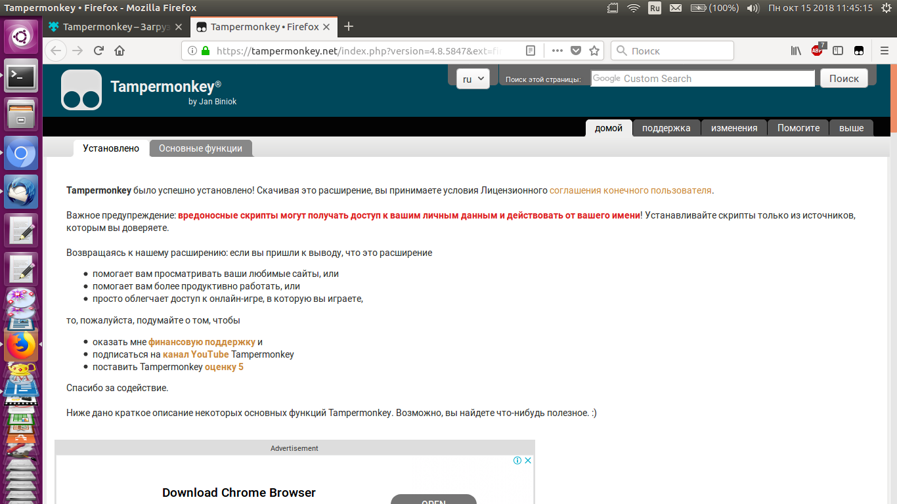
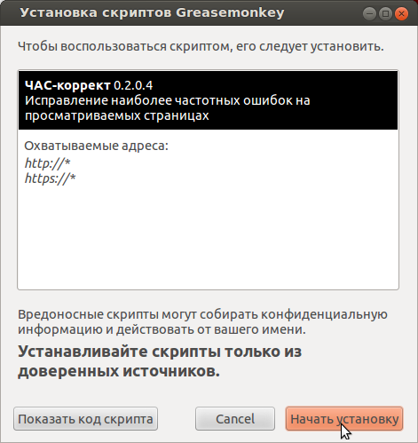
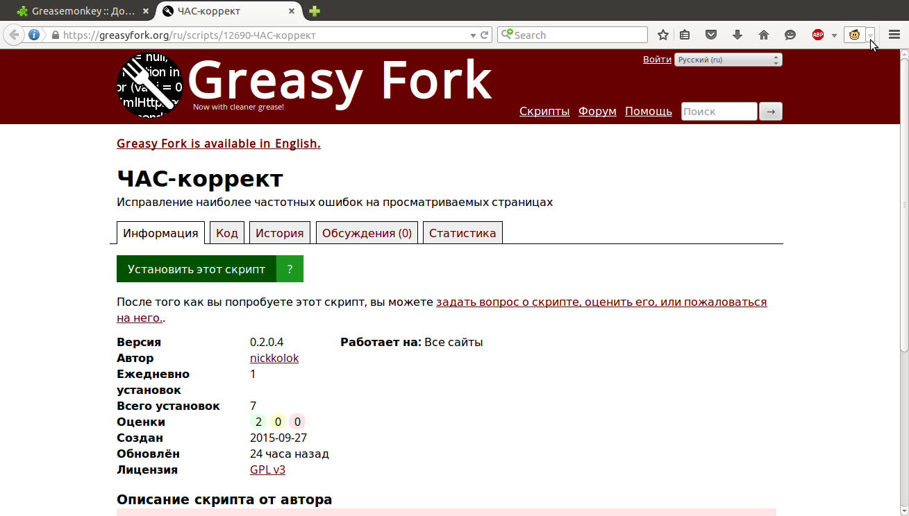
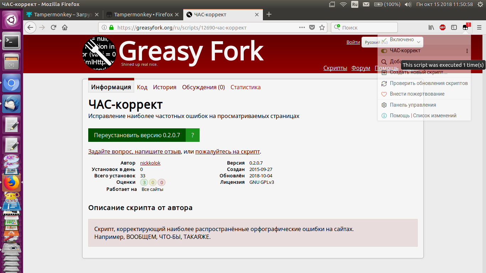

#Инструкция по установке "ЧАС-коррект" на Firefox и ему подобные браузеры
*(Например, SeaMonkey)*

1. Открываем [страницу расширения TamperMonkey](https://addons.mozilla.org/ru/firefox/addon/greasemonkey/) в каталоге дополнений.
Это - программа-переходник между браузером и собственно "ЧАС-коррект". По некоторым причинам установка напрямую возможна, но нежелательна.
2. Нажимаем "Добавить в Firefox" (синня кнопка с плюсиком). 

3. Устанавливаем расширение. Кнопка может называться "Install", "Установить" или "Добавить". Если кнопки нет, то стоит нажать за зелёный значок детали мозаики:

4. Нажимаем "ОК" в сообщении о том, что расширение установлено.
5. Закрываем вот такую страницу, которая агитирует нас быть бдительными:

6. Теперь переходим на [страницу собственно "ЧАС-коррект"](https://greasyfork.org/ru/scripts/12690-ЧАС-коррект/).
7. Нажимаем "Установить этот скрипт".

8. Ещё раз выбираем "Установить"

9. Теперь обновляем эту страницу. Если Вы не видете сдесь ошыбок - значит, оно работает!

Кстати, при желании можно отключить коррекцию на некоторое время. В меню TamperMonkey:

Зелёное - включено, серое - выключено, переключать щелчком.
